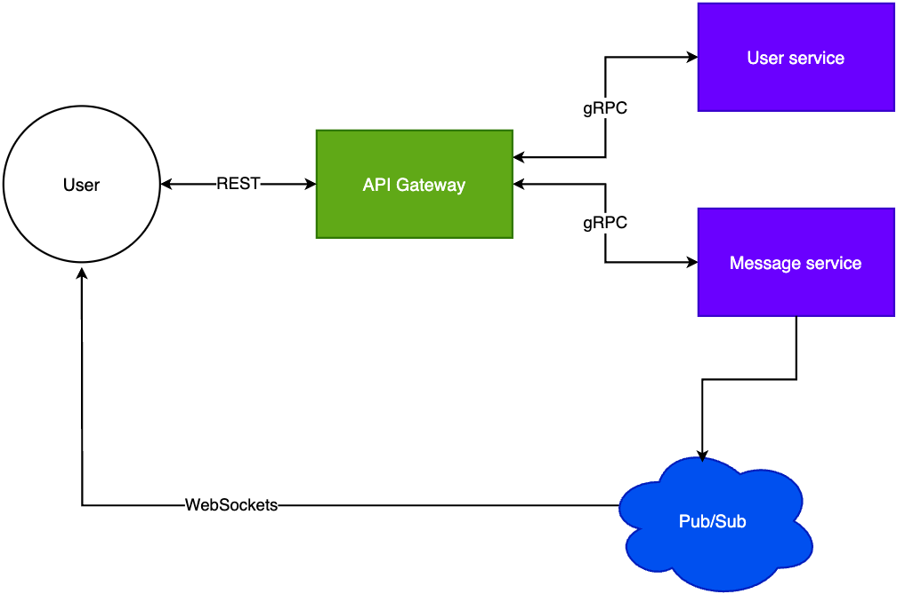

# Chat app
## Overview
This project is simple chat application. Its purpose it's to test services, technologies and patterns, such as:
- gRPC,
- Azure Web PubSub,
- Gateway API, 
- Svelte, etc.

and use them together to test architectural decisions. 

## System Architecture
The main components are:



- **API Gateway:** It's the conductor of the requests the users send. It connects with services through gRPC.
- **Services:** The idea is each service should be independent from each one.
  - User: It handles user registration and verification.
  - Message: It sends over the messages the users send.
- **User interface:** It's where users send their messages.

## Implementation
The implementation uses:
- Python program for the services,
- ASP.NET for the Gateway API, and
- Svelte for the user interface.

The idea is that you could substitute one of the component implementations for other and the application should be 
working properly.

For example, you can create a _Message service_ using Java. Then, you can communicate with the Gateway API using 
gRPC with Protocol Buffers.

## How to run
You can run each component independently. For example, the python Message service:
```shell
python message_service.py
```

You need to use this environment variables too:
- `CONNECTION_STRING`
- `HUB`

For more information, you can check out [the other README.](./python/message/README.md)

